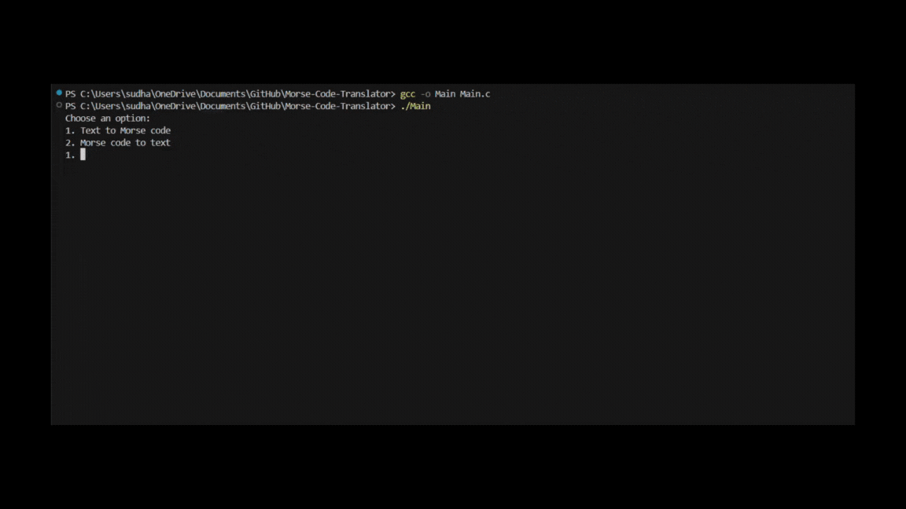

# Morse Code Translator
This is a simple C program that translates English text into Morse code and vice versa.

## Preview
<picture></picture>

## Compilation and Execution
1. To check whether MinGW is recognized by your system, use the following command:
   ```
   gcc -v
   ```
2. use the play button in the top right corner to run and debug the code.

3. To compile the game, use the following command:
   ```
   gcc -o Main Main.c
   ```

   To run the compiled program:
   ```
   ./Main
   ```

   If you encounter any issues setting up MinGW on Windows, refer to this guide: 
   [How to run a C program in Visual Studio Code](https://www.javatpoint.com/how-to-run-a-c-program-in-visual-studio-code)
  
## Example Input and Output
1. Text to Morse Code with Numbers:
   Input:
   ```
   HELLO WORLD 2024
   ```
   Output:
   ```
   .... . .-.. .-.. --- / .-- --- .-. .-.. -.. / ..--- ----- ..--- ....-
   ```

2. Morse Code to Text with Numbers:
   Input:
   ```
   .... . .-.. .-.. --- / .-- --- .-. .-.. -.. / ..--- ----- ..--- ....-
   ```
   Output:
   ```
   HELLOWORLD2024
   ```

__***Note***__: The program uses the standard Morse code chart to translate between English text and Morse code.

## Dependencies
Standard C library: 
- [MinGW](https://sourceforge.net/projects/mingw/)
- [C/C++](https://marketplace.visualstudio.com/items?itemName=ms-vscode.cpptools)